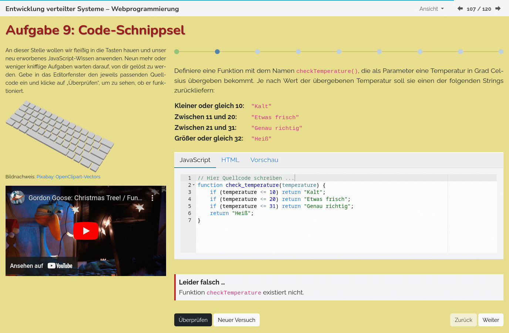

lecture-slides.js: Ace Code Editor Plugin
=========================================

1. [Description](#description)
1. [Installation](#installation)
1. [Usage](#usage)
1. [Caveat Emptor](#caveat-emptor)
1. [Copyright](#copyright)

Description
-----------

This is a minimal wrapper around the [Ace Code Editor](https://ace.c9.io/)
to be able to easily add small code editors to learning materials created with
[lecture-slides.js](https://www.github.com/DennisSchulmeister/lecture-slides.js) or
[mini-tutorial.js](https://www.github.com/DennisSchulmeister/mini-tutorial.js).



Installation
------------

 1. Add the plugin to your project: `$ npm add --save-dev @dschulmeis/ls-plugin-ace-code`.
 2. Import it in the `index.js` file.
 3. Import one of more of the [builtin languages](https://github.com/ajaxorg/ace/tree/master/src/mode) (called modes by Ace).
 3. Import one of more of the [builtin themes](https://github.com/ajaxorg/ace/tree/master/src/theme).
 4. Add a new plugin instance to the `SlideshowPlayer` or `MiniTutorial` instance.
 4. Use the HTML tags in your presentation.

```javascript
import SlideshowPlayer               from "@dschulmeis/lecture-slides.js";
import LS_Plugin_AceCode             from "@dschulmeis/ls-plugin-ace-code";
import { Mode as AC_Mode_HTML }      from "ace-builds/src-noconflict/mode-html.js";
import { Mode as AC_Mode_CSS }       from "ace-builds/src-noconflict/mode-css.js";
import { Mode as AC_Mode_JS }        from "ace-builds/src-noconflict/mode-javascript.js";
import "ace-builds/src-noconflict/theme-cloud9_day";

window.addEventListener("load", () => {
    let player = new SlideshowPlayer({
        plugins: {
            AceCode: new LS_Plugin_AceCode({
                theme: "cloud9_day",
                modes: {
                    html: AC_Mode_HTML,
                    css:  AC_Mode_CSS,
                    js:   AC_Mode_JS,
                },
            }),
        }
    });

    player.start();
});
```

Usage
-----

The plugin provides a new custom element named `<ace-code>`, that can be used like this:

```html
<ace-code
    mode    = "js"
    theme   = "cloud_editor"
    options = '{"readOnly": true}'
    style   = "height: 15em; font-size: 80%;"
>
    // Content of the code editor
</ace-code>
```

* **NOTE:** Make sure to set the height of the element. Otherwise the editor will be invisible. :-)
* The theme name can be omitted if a global theme has been set during application start-up.
* The options property is a JSON string with [editor options](https://ajaxorg.github.io/ace-api-docs/interfaces/ace.Ace.EditorOptions.html).
* The mode must be the name of a language as passed to the plugin constructor in `index.js`.
* If no mode is given or the mode is not found, the editor will use plain text mode.
* To access the code editor's content, simply give it an ID and get the `editor` property of the element:

```html
<ace-code
    id      = "CodeEditor"
    mode    = "js"
    theme   = "cloud_editor"
    style   = "height: 15em; font-size: 80%;"
>
    // Write your code here
</ace-code>

<button onclick="validate_code()">Validate Code</button>

<script>
    function validate_code() {
        let codeEditor = document.querySelector("#CodeEditor");
        let sourceCode = codeEditor.editor.getValue();

        // Validation logic here ...
    }
</script>
```

The `editor` property will contain the [Editor instance](https://ajaxorg.github.io/ace-api-docs/interfaces/ace.Ace.Editor.html).

Caveat Emptor
-------------

Note, that the custom elements defined by the various lecture-slides.js plugins are no
real custom elements like web components. They are implemented by replacing the custom
HTML tags with proper HTML code on page load. Therefor you should wait until the app has
finished processing the HTML code before accessing the element. Otherwise you might get
a reference to the original `<ace-code>` which will disappear later.

If all you need is the Editor instance, this won't be a problem, as the `editor` property
will be set to both the `<ace-code>` and the `<div>` that replaces it. But, if you need
to do something special with the `<div>`, you need to wait as in the example above.

Copyright
---------

lecture-slides.js: https://www.github.com/DennisSchulmeister/lecture-slides.js <br/>
mini-tutorial.js: https://www.github.com/DennisSchulmeister/mini-tutorial.js <br/>
ls-plugin-ace-code: https://github.com/DennisSchulmeister/ls-plugin-ace-code <br/>

© 2017 – 2024 Dennis Schulmeister-Zimolong <dennis@pingu-mail.de> <br/>
Licensed under the 2-Clause BSD License.
